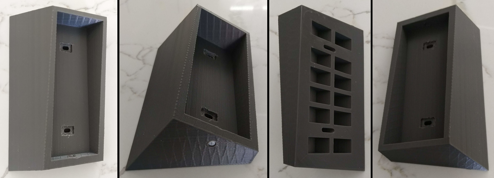

# Eufy Doorbell Mount

[![CC BY-NC-SA 4.0][cc-by-nc-sa-shield]][cc-by-nc-sa]

This work is licensed under a
[Creative Commons Attribution-NonCommercial-ShareAlike 4.0 International License][cc-by-nc-sa].

[![CC BY-NC-SA 4.0][cc-by-nc-sa-image]][cc-by-nc-sa]

A mount for the Eufy 2K Wireless (Battery Powered) Doorbell. Addresses several perceived issues with the standard mounts:

1. The lack of security in the exposed removal hole
2. Only 0° and 15° mounting options
3. The lack of security in the provided backing having a smaller footprint than the doorbell itself, making it vulnerable to being levered off (say using a hammer or crowbar)

<b>
The mount on the wall.
</b>

## Features

This repository contains a FreeCAD model (`FCStd`) for a mount that augments the provided mount to address the above problems:

1. The removal tool hole is concealed by a screw, requiring an additional tool for its removal (to hopefully reduce opportunistic theft)
2. The mounting angle can be varied from 5° through to 31° (via a FreeCAD variable)
3. The sides of the mount are tapered (10° in the model, which is also configurable) to reduce the ability to pry the mount from the wall.

Pre-exported `STL`s are also provided for 15° and 30° (facing 'right'—mirror the model in your slicing tool for the other direction).

<b>
The printed mount: (a) view from the front, (b) the view from the bottom, showing a nylon screw covering the removal tool hole, (c) the view of the back (wall side), and (d) the view from above.
</b>

## Notes

### Printing

The example shown above took approximately 11 hours to print on relatively coarse settings.

### Installation

A M3 threaded insert was used, together with a short nylon M3 machine screw. It can be seen in the image of the print shown above (second from the left).

Due to the added length, new screws were required for wall mounting (at a 30° angle). 50mm long 6g (3.5mm) screws worked fine with the provided plugs.

### Limitations

The CAD model assumes there is some angle, so some heavy tweaking is required if an angle below about 5° is needed. Similarly, one of the cutouts in the CAD model is not large enough for angles above about 40°, which should be an easy fix. Note that at that angles above around 35° it is likely that the screw head would interfere with the doorbell's ability to latch to its bracket.

[cc-by-nc-sa]: http://creativecommons.org/licenses/by-nc-sa/4.0/
[cc-by-nc-sa-image]: https://licensebuttons.net/l/by-nc-sa/4.0/88x31.png
[cc-by-nc-sa-shield]: https://img.shields.io/badge/License-CC%20BY--NC--SA%204.0-lightgrey.svg

